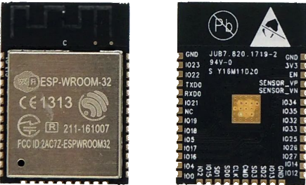

<h3> </h3>

MicroPython for bare ESP32 IOT Web System
=======================
<h2>w/ FTP updates</h2>

  

<h3> </h3>
<h3>
<A HREF="https://github.com/SilverLogix/ESP32-Web-System/releases/tag/v1.1">Latest Update</a>
</h3>