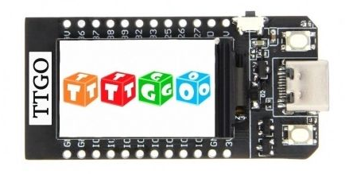

MicroPython for the LilyGo TTGO
=======================
<h2>w/ ST7789 C driver</h2>

  

<h3> </h3>
<h3>
<A HREF="https://github.com/SilverLogix/MicroPython-TTGO/releases/tag/v1.1">Latest Update</a>
</h3>